# EpicTours Alignment System — How It Works

The alignment system gives every agent session the same institutional memory: universal engineering principles + EpicTours-specific rules + active project state. It compounds over time — each session can add to it, never degrades.

---

## Session Flow

```mermaid
flowchart TD
    A([Session Start]) --> B["/boot"]
    B --> C["📖 pearls.md\n(28 universal rules)"]
    B --> D["📖 AGENT_ALIGNMENT.md\n(14 commandments + identity)"]
    B --> E["📖 PROJECT_STATUS.md\n(active mission)"]
    C & D & E --> F["⚡ Boot canary:\n'28 pearls loaded. Mission: ...'"]
    F --> G([Build])
    G --> H{">2 debug\ncycles?"}
    H -- Yes --> I["Auto-run wisdom-harvest"]
    H -- No --> J([Session ends])
    I --> J
```

---

## Knowledge Architecture

---

## Control Commands

| Command | When to Use | What It Does |
|---------|-------------|--------------|
| `/boot` | **Every session start** | Reads pearls → constitution → mission → fires canary |
| `/align` | Mid-session re-align | Same as boot without git pull, lighter weight |
| `/debrief` or `"harvest"` | End of session | Runs wisdom-harvest: extract pearls, update project state |
| `/gitpush` | Save work | Stages, commits, pushes all changes |
| `/gitpull` | Sync from remote | Pulls latest pearls from other contributors |

---

## The Pearl Lifecycle

```mermaid
flowchart LR
    S["🌱 Seed\n(new, unconfirmed)"]
    C["🔵 Confirmed\n(seen again)"]
    E["⭐ Established\n(battle-tested)"]
    EV["❌ Evicted\n(cap hit, oldest Seed first)"]

    S -- "Confirmed in another session" --> C
    C -- "Confirmed again" --> E
    S -- "111 cap hit" --> EV
    C -- "111 cap hit\n(no Seeds remain)" --> EV
    E -- "Never evicted\nwithout approval" --> E
```

---

## The 111-Pearl Cap

When a new pearl is added and the total exceeds **111**:
1. Find the oldest **Seed**-maturity pearl → delete it
2. If no Seeds: find oldest **Confirmed** → delete it
3. **Established** pearls are never deleted without explicit approval

Every 90 days: Seeds that haven't been promoted get flagged during harvest for review.

---

> **Current status**: 28 / 111 pearls active · System locked at 95% · Ready for live testing
